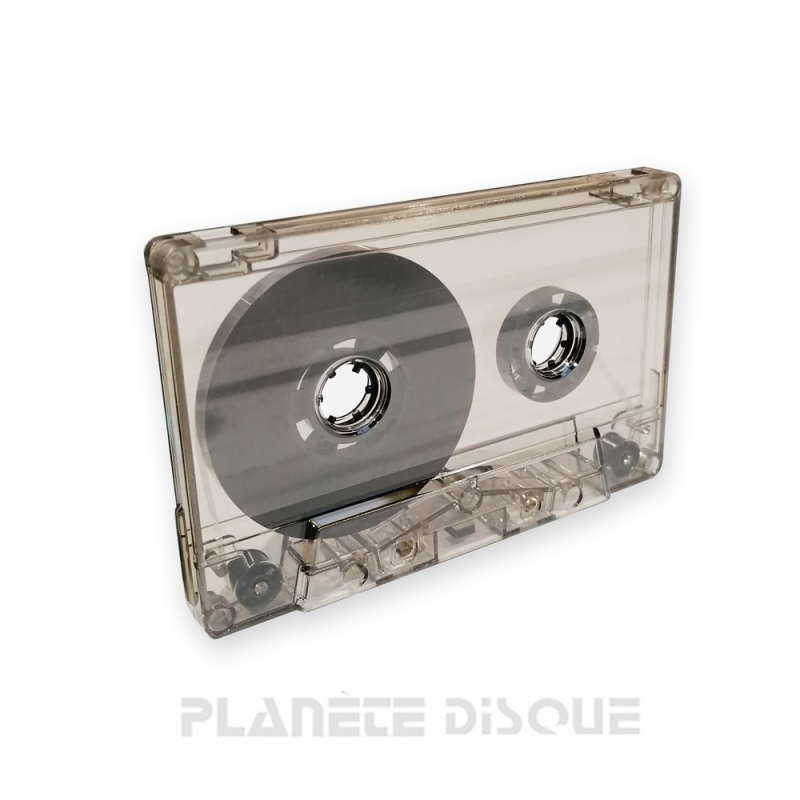
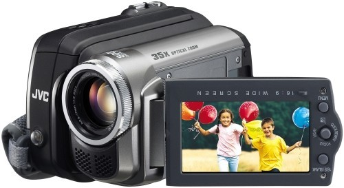

# Proyecto 3: Módulo Landing de Negocio:
# Introducción:
Fuentes Keim Spa es mi sitio web dedicado al servicio de traspasos de formatos de video y audio analógicos a los nuevos formatos digitales usados en la actualidad.  El objetivo de este proyecto es crear una landing page personalizada que ayude al usuario a entender el objetivo y el alcance del servicio.

# Proceso de Desarrollo:
## Planificación y Prototipado
Antes de comenzar con el desarrollo del sitio web, se realizó un prototipo simple para definir la estructura y el diseño. Utilicé una herramienta de dibujo gratuita, draw.io, para crear un esquema visual de cómo quería que fuera la página.


Este dibujo me permitió visualizar la disposición de cada sección y asegurarme de que todos los elementos necesarios estuvieran presentes.

# Desarrollo de la Estructura HTML
Con el prototipo como guía, se construye así el esqueleto básico por decirlo así del sitio usando HTML5. Definí las siguientes secciones:

- Header: Incluye el logo y las áreas principales del sitio.
- Main: Presenta el producto al usuario, incluyendo un título, una descripción y un formulario para introducir el correo.
- Products: Muestra un catálogo breve de los productos destacados.
- Footer: Contiene enlaces a las diferentes áreas del sitio y nuestras redes sociales.


```scss
<!DOCTYPE html>
<html lang="en">
<head>
    <meta charset="UTF-8">
    <meta name="viewport" content="width=device-width, initial-scale=1.0">
    <link rel="stylesheet" href="estilos.css">
    <link href="https://cdn.jsdelivr.net/npm/remixicon@4.2.0/fonts/remixicon.css" rel="stylesheet"/>

<title>Fuentes Keim Spa: Traspasos digitales a un clic de distancia</title>
</head>
<body>
    <main class="container">
        <!-- Navegación -->
        <nav>
            <div class="nav__bar">
                <a href="#" class="nav__logo">
                     <!-- Logo de la empresa -->
                  
                  <span></span>
                </a>
                <div class="nav__menu__btn" id="menu-btn">
                    <i class="ri-menu-3-line"></i>
                </div>
            </div>
            <!-- Enlaces de navegación -->
            <ul class="nav__links" id="nav-links">
                <li><a href="#">Home</a></li>
                <li><a href="./galeria.html">Galería</a></li>
                <li><a href="#">Servicios</a></li>
                <li><a href="#">Contactos</a></li>
            </ul>
        </nav>
```
```
Sección Principal: 

```scss
<!-- Contenido principal -->

```

        <!-- Contenido principal -->
           
            <div class="container__content">
                <h1>Servicios </h1>
                <h2>Preserva tus recuerdos: </h2>
                <p> Transforma tus archivos analógicos en tesoros digitales para que las generaciones futuras puedan disfrutar de tu legado audiovisual.</p>
                <!-- Redes sociales -->
                <div class="socials">
                    <a href="https://www.instagram.com/fuenteskeimspa/"><i class="ri-instagram-line"></i></a>
                    <a href="#"><i class="ri-facebook-line"></i></a>
                    <a href="#"></a><i class="ri-tiktok-line"></i></a>
                    <a href="#"><i class="ri-twitter-line"></i></a>
                    </div>
                </div>
            </div>
         </div>

         <!-- Sección de productos -->
         <section class="container__flex">
            <div class="container__content2">
                <h1>Soporte de Formatos</h1>
                <p>Nuestro servicio de digitalización convierte tus preciados recuerdos analógicos en formatos digitales de alta calidad. Soportamos una amplia gama de formatos, incluyendo VHS, VHS-C, MiniDV, DVD’s de cámaras de video, discos de vinilo y cassettes de audio. Con nuestra tecnología avanzada, garantizamos la preservación de tus momentos más valiosos, asegurando que puedas disfrutarlos y compartirlos fácilmente en el presente y el futuro. ¡Confía en nosotros para mantener vivos tus recuerdos!</p>
                <div id="productos" class="productos">
                    
                    
                    
                    
                </div>
                <div id="productos" class = "productos">
                    
                    
                    
                    
                </div>
            </div>
        </section>

        <footer class="footer">
            <div class="footer__content">
                <p>Contacto: <a href="mailto:info@valeriapastelera.com">valeriapastelera@gmail.com</a></p>
                <div class="socials">
                    <a href="https://www.instagram.com/valeriapastelera/?igsh=NDJhaXB6ZDJjN2t5"><i class="ri-instagram-line"></i></a>
                    <a href="#"><i class="ri-facebook-line"></i></a>
                    <a href="https://www.tiktok.com/<i class="ri-tiktok-line"></i></a>
                    <a href="#"><i class="ri-twitter-line"></i></a>
            </div>
            <div>
                <p>&copy; 2024 Fuentes Keim Spa. </p>
            </div>

        </footer>
     </main>
     <script src="./vp.js"></script>
</body>
</html>
```


# Aplicación de Estilos CSS

Luego, apliqué estilos CSS para dar formato y mejorar la apariencia de la página. Utilicé un archivo styles.css para mantener el código organizado y facilitar futuras modificaciones.

A continuación, presento solo algunas partes del código CSS utilizado en el desarrollo del sitio, ya que es bastante extenso:
Encabezado:
```scss
nav {
    top: 0;
    width: 100%;
    background-color: rgb(250, 253, 255);
    z-index: 9;
    display: flex;
    justify-content: center;
    align-items: center;
    padding: 1.5rem;
}

.nav__bar {
    display: flex;
    justify-content: space-between;
    align-items: center;
    width: 100%;
    max-width: var(--max-width);
}

.nav__logo img {
    max-width: 250px;
    width: 70%;
}

.nav__links {
    list-style: none;
    display: flex;
    gap: 2rem;
    margin-left: auto;
}

.nav__links a {
    font-size: 1.5rem;
    font-weight: 500;
    color: var(--primary-color);
    transition: 0.3s;
}

```
Sección Principal: 

```scss
.container__grid {
    display: grid;
    grid-template-columns: 1fr 1fr;
    gap: 2rem;
    max-width: var(--max-width);
    margin: auto;
    padding: 2rem 1rem;
    align-items: center;
    text-align: left;
}

.container__content h1 {
    font-size: 2.5rem;
    font-weight: 600;
    line-height: 3rem;
    color: var(--primary-color);
    margin-bottom: 0.5rem;
}

.container__content h2 {
    margin-bottom: 0.5rem;
    max-width: 450px;
    font-size: 1.5rem;
    font-weight: 400;
    line-height: 2rem;
    color: var(--primary-color);
}

.container__content p {
    margin-bottom: 1rem;
    max-width: 450px;
    color: var(--primary-color);
}
```

Sección de Productos:

```scss

.container__content2 h1 {
    font-size: 2rem;
    font-weight: 600;
    line-height: 2.5rem;
    color: var(--primary-color);
    margin-bottom: 1rem;
}

.productos {
    display: flex;
    flex-wrap: wrap;
    gap: 0.5rem;
    justify-content: center;
}

.productos img {
    width: calc(35% - 0.5rem);
    height: auto;
    max-width: 150px;
    border-radius: 8px;
    transition: 0.5s;
}

.productos img:hover {
    transform: scale(1.05);
}
```

Pie de Página:

```scss

.footer {
    background-color: rgb(250, 253, 255);
    padding: 2rem;
    text-align: center;
    width: 100%;
}

.footer__content {
    max-width: var(--max-width);
    margin: auto;
    color: var(--text-dark);
}

.footer__content a {
    color: var(--primary-color);
    text-decoration: none;
}

.footer__content a:hover {
    text-decoration: underline;
}

.footer__content .socials a {
    color: var(--primary-color);
    font-size: 1.5rem;
    transition: 0.3s;
}

.footer__content .socials a:hover {
    color: hotpink;
}

```

Este resumen destaca las secciones principales del código CSS que afectan el encabezado, el contenido principal, la sección de productos y el pie de página.


# Aplicación de JS

 ```scss

const menuBtn = document.getElementById(`menu-btn`);
const navLinks = document.getElementById(`nav-links`);
const menuBtnIcon = menuBtn.querySelector("i")

menuBtn.addEventListener("click", ()=> {
    navLinks.classList.toggle("open");

    const isOpen = navLinks.classList.contains("open");
    menuBtnIcon.setAttribute(
        "class",
        isOpen ? "ri-close-line" : "ri-menu-3-line"
    );
});

const scrollRevealOption = {
    distance: "50px",
    origin: "buttom",
    duration: 1000,
}

ScrollReveal().reveal(".container__content h1", {
    ...scrollRevealOption,
});

```


Utilicé la herramienta de GitHub Pages para que se publicara en línea. El sitio de Fuentes Keim SPa está en el siguiente enlace:
[https://mariavaleriavarela.github.io/Proyecto3/](https://alvarofuente-cl.github.io/Proyecto-3/)

# Conclusión:

Este proyecto me permitió aplicar conocimientos en HTML y CSS para crear una página web funcional y estética. Desde la planificación, el prototipado Y hasta el desarrollo. Cada paso fue crucial para asegurar que el producto final cumpliera con los requisitos y ofreciera una excelente experiencia de usuario.

# Gracias!!


